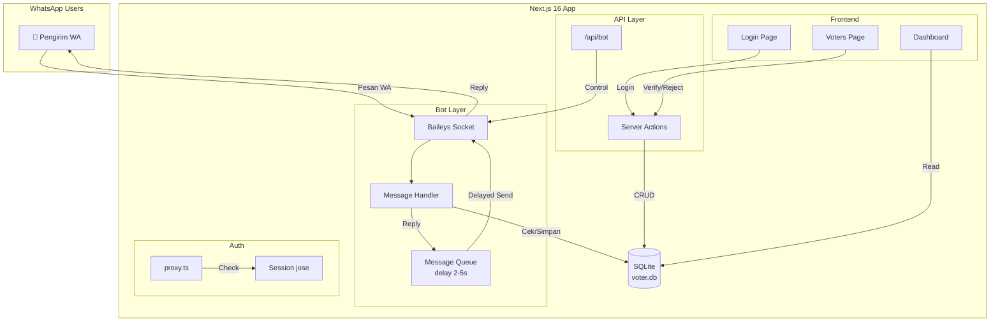

# WhatsApp Voter Registration Bot

Membangun bot WhatsApp untuk pendaftaran peserta voting. Pengirim mengirimkan **Nama** dan **Organisasi** via WhatsApp, backend memproses dan menyimpan data. Admin memverifikasi pendaftar melalui dashboard web untuk mengurangi risiko voter bayangan.

## User Review Required

> [!IMPORTANT]
> **Tech stack**: Next.js 16.1.6 + shadcn UI, `@whiskeysockets/baileys` (WhatsApp), `better-sqlite3` (SQLite), `jose` (JWT session). **Runtime: Bun**, **Linter/Formatter: Biome.js**. Menggunakan `proxy.ts` (bukan middleware.ts) sesuai Next.js 16 convention.

> [!WARNING]
> **Anti-blocking strategy**: Bot menggunakan message queue dengan configurable delay (default 2–5 detik random) antar respons untuk menghindari pemblokiran oleh WhatsApp. Jika delay ini terlalu lama/cepat, bisa disesuaikan via environment variable.

> [!CAUTION]
> **Route grouping**: Menggunakan `(auth)` dan `(dashboard)` route groups untuk mencegah redirect loop. `proxy.ts` hanya melakukan optimistic check (baca cookie, bukan query DB) dan tidak redirect jika sudah di halaman yang benar.

---

## Proposed Changes

### 1. Project Initialization

#### [NEW]
- Init: `bun create next-app@16.1.6 ./ --react-compiler --biome --tailwind`
- Sudah termasuk: TypeScript, Tailwind CSS, Biome.js (linter/formatter), React Compiler
- Dependencies tambahan (via `bun add`):
  - `@whiskeysockets/baileys` — WhatsApp multi-device API
  - `better-sqlite3` + `@types/better-sqlite3` — SQLite driver
  - `jose` — JWT encrypt/decrypt untuk session
  - `zod` — Schema validation
  - `bcryptjs` + `@types/bcryptjs` — Password hashing
  - `server-only` — Ensure server-side only modules

#### [NEW] [.env.local]
```env
SESSION_SECRET=<generated-32-char-base64>
ADMIN_USERNAME=admin
ADMIN_PASSWORD=admin123
BOT_REPLY_MIN_DELAY_MS=2000
BOT_REPLY_MAX_DELAY_MS=5000
```

#### [NEW] shadcn UI setup
- `bunx --bun shadcn@latest init`
- Components: `button`, `input`, `card`, `table`, `badge`, `dialog`, `dropdown-menu`, `toast`, `label`, `separator`

---

### 2. Database Layer (SQLite)

#### [NEW] [db.ts]
- Singleton `better-sqlite3` connection ke `data/voter.db`
- Auto-create `data/` directory

#### [NEW] [schema.ts]
```sql
CREATE TABLE IF NOT EXISTS voters (
  id INTEGER PRIMARY KEY AUTOINCREMENT,
  phone TEXT UNIQUE NOT NULL,
  name TEXT NOT NULL,
  organization TEXT NOT NULL,
  status TEXT DEFAULT 'pending' CHECK(status IN ('pending','verified','rejected')),
  created_at TEXT DEFAULT (datetime('now'))
);

CREATE TABLE IF NOT EXISTS admins (
  id INTEGER PRIMARY KEY AUTOINCREMENT,
  username TEXT UNIQUE NOT NULL,
  password_hash TEXT NOT NULL
);
```

#### [NEW] [seed.ts]
- Script untuk insert admin default (dari `.env`)
- Dijalankan saat DB init jika tabel admins kosong

#### [NEW] [voters.ts]
- `findByPhone(phone)` — cek apakah nomor sudah terdaftar
- `create({ phone, name, organization })` — simpan voter baru
- `getAll(filter?)` — ambil semua voter (dengan filter status)
- `updateStatus(id, status)` — verifikasi/reject voter
- `getStats()` — count per status

#### [NEW] [admins.ts]
- `findByUsername(username)` — untuk login
- `createAdmin(username, password)` — untuk seed

---

### 3. Authentication System

#### [NEW] [session.ts]
- `encrypt(payload)` — Sign JWT dengan `jose` (HS256, 7 hari expiry)
- `decrypt(token)` — Verify JWT
- `createSession(userId)` — Set httpOnly cookie `session`
- `deleteSession()` — Delete cookie
- `getSession()` — Read & decrypt session dari cookie

#### [NEW] [auth.ts]
- `login(state, formData)` — Server Action: validate credentials → createSession → redirect `/dashboard`
- `logout()` — Server Action: deleteSession → redirect `/login`

#### [NEW] [proxy.ts]
```typescript
// Menggunakan proxy.ts (BUKAN middleware.ts) sesuai Next.js 16
export async function proxy(req: NextRequest) {
  const path = req.nextUrl.pathname
  const isProtected = path.startsWith('/dashboard')
  const isAuthPage = path === '/login'
  
  const cookie = (await cookies()).get('session')?.value
  const session = await decrypt(cookie)
  
  // Redirect ke /login jika belum auth
  if (isProtected && !session?.userId) {
    return NextResponse.redirect(new URL('/login', req.nextUrl))
  }
  
  // Redirect ke /dashboard jika sudah auth dan akses /login
  if (isAuthPage && session?.userId) {
    return NextResponse.redirect(new URL('/dashboard', req.nextUrl))
  }
  
  return NextResponse.next()
}

export const config = {
  matcher: ['/((?!api|_next/static|_next/image|.*\\.png$).*)'],
}
```

> [!NOTE]
> Proxy hanya melakukan **optimistic check** (baca cookie saja, tidak query DB). Pengecekan session yang lebih mendalam dilakukan di Server Components/Actions via Data Access Layer.

---

### 4. WhatsApp Bot (Baileys)

#### [NEW] [whatsapp.ts]
- Singleton Baileys connection (WASocket)
- Session persistence ke `data/wa-session/`
- QR code event handler (simpan ke memory untuk ditampilkan)
- Connection state management (connecting, open, close)

#### [NEW] [message-queue.ts]
```typescript
// Anti-blocking: Queue-based message processing
class MessageQueue {
  private queue: QueueItem[] = []
  private processing = false
  
  add(to: string, message: string): void
  
  private async process(): Promise<void> {
    // Process satu per satu dengan random delay
    // MIN_DELAY..MAX_DELAY ms antar pesan
    const delay = randomBetween(
      BOT_REPLY_MIN_DELAY_MS,
      BOT_REPLY_MAX_DELAY_MS
    )
    await sleep(delay)
    await sendMessage(to, message)
  }
}
```

#### [NEW] [message-handler.ts]
```
Flow:
1. Terima pesan masuk
2. Parse: baris pertama = Nama, baris kedua = Organisasi
3. Cek phone di DB:
   - Belum terdaftar → simpan → queue reply "Terima kasih {Nama}! Anda telah terdaftar dari {Organisasi}. Silakan tunggu verifikasi admin."
   - Sudah terdaftar → queue reply "Nomor Anda sudah terdaftar dengan nama {nama}."
4. Format tidak sesuai → queue reply panduan: "Untuk mendaftar, kirim pesan dengan format:\nNama\nOrganisasi"
```

#### [NEW] [bot route.ts]
- `GET` — Status bot (connected/disconnected) + QR code (base64)
- `POST` — Start/stop/restart bot connection (auth required)

---

### 5. Admin Dashboard (Frontend)

#### [NEW] Route Group Layout — Anti Redirect Loop

```
src/app/
├── (auth)/
│   ├── layout.tsx          ← minimal layout, tanpa sidebar
│   └── login/
│       └── page.tsx        ← halaman login
├── (dashboard)/
│   ├── layout.tsx          ← layout dengan sidebar/nav + session check
│   ├── dashboard/
│   │   └── page.tsx        ← overview/stats
│   └── voters/
│       └── page.tsx        ← tabel voter + verifikasi (/voters)
├── api/
│   └── bot/
│       └── route.ts
├── layout.tsx              ← root layout (html, body, font)
└── page.tsx                ← landing page publik
```

> [!NOTE]
> **Anti redirect loop**: Route groups `(auth)` dan `(dashboard)` memiliki layout terpisah. Root `page.tsx` adalah landing page publik (bukan redirect). Proxy.ts mengecek `isAuthPage` dan `isProtected` secara mutual exclusive.

> [!NOTE]
> **Shorter URLs**: Voters page berada langsung di `(dashboard)/voters/` sehingga URL-nya `/voters` bukan `/dashboard/voters`.

#### [NEW] [landing page.tsx]
- Landing page publik: hero section, cara pendaftaran via WA, statistik pendaftar
- CTA button ke `/login` untuk admin
- Design: modern, gradient background, glassmorphism cards

#### [NEW] [login page.tsx]
- Form login dengan shadcn `Input`, `Button`, `Card`
- `useActionState` untuk handle form submission & error display
- Design: centered card, dark theme, gradient background

#### [NEW] [dashboard layout.tsx]
- Server Component: verify session → redirect jika tidak valid
- Sidebar navigation: Dashboard, Voters, Bot Status
- Header: admin name + logout button

#### [NEW] [dashboard page.tsx]
- Stats cards: Total Pendaftar, Terverifikasi, Pending, Ditolak
- Bot status card dengan QR code display
- Recent registrations preview

#### [NEW] [voters page.tsx]
- DataTable dengan kolom: No HP, Nama, Organisasi, Status, Tanggal, Actions
- Filter by status (All, Pending, Verified, Rejected)
- Actions: Verify ✓, Reject ✗ (via Server Actions)
- Badge warna per status (kuning=pending, hijau=verified, merah=rejected)

#### [NEW] Server Actions untuk voters
- [voters-actions.ts]
  - `verifyVoter(id)` — update status ke 'verified'
  - `rejectVoter(id)` — update status ke 'rejected'
  - `deleteVoter(id)` — hapus voter

---

## Arsitektur



---

## Verification Plan

### Automated Tests (via Browser)
1. **Login flow**: Buka `/login` → isi username/password → submit → harus redirect ke `/dashboard`
2. **Protected route**: Akses `/dashboard` tanpa login → harus redirect ke `/login`
3. **Redirect loop**: Login → akses `/login` → harus redirect ke `/dashboard` (tidak loop)
4. **Voters table**: Login → buka `/dashboard/voters` → harus menampilkan tabel

### Manual Verification (User)
1. **Bot connection**: Start bot dari dashboard → scan QR code dengan WhatsApp
2. **Registration flow**: Kirim pesan `Nama\nOrganisasi` ke bot → cek reply "terima kasih"
3. **Duplicate check**: Kirim pesan lagi dari nomor yang sama → cek reply "sudah terdaftar"
4. **Voter verification**: Login admin → buka Voters → klik Verify pada pendaftar → cek status berubah
5. **Queue delay**: Kirim beberapa pesan berturut-turut → observasi delay antar reply (2-5 detik)
